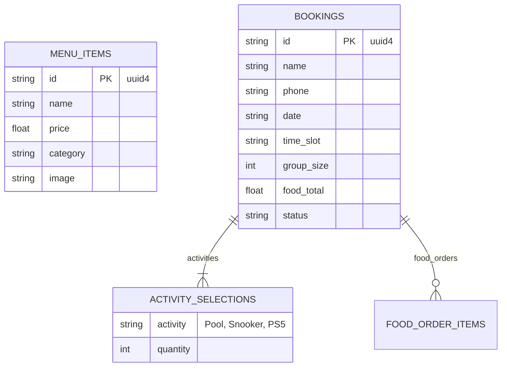

# Rack&Roll Cafe: Premium Gaming Lounge & Backend Engine


Welcome to the **Rack&Roll Cafe** project repository! This application is a full-stack platform providing an immersive digital landing page, a sophisticated Snooker/PS5 booking engine, a dynamic culinary menu, and an AI-driven digital host (The AI Lounge).

The interface leans into a dark, electric, and sophisticated visual identity ("Underground Club"), powered by high-performance React animations (GSAP) and a robust asynchronous Python backend (FastAPI + MongoDB).

---

## ⚡ Key Features

*   **Immersive Frontend Experience:** A high-performance React application powered by deep GSAP integrations and Lenis smooth scrolling that captivates visitors with rich micro-transitions and glass-morphism UI.
*   **Intelligent Availability & Booking Engine:** A sophisticated Python (FastAPI) and MongoDB aggregation engine dynamically computes session availability. It respects hard hardware constraints (e.g., maximum 1 Snooker table, 2 PS5s) to guarantee double-booking cannot occur.
*   **The AI Lounge (Digital Host):** Integrated directly with large language models via Google Gemini Flash, providing hyper-contextual recommendations to patrons natively without breaking the brand's persona.
*   **Dynamic Culinary Menu:** A robust backend-seeded menu system serving high-resolution UI elements and localized INR-based pricing through asynchronous backend queries.
*   **Administrative Notifications:** Seamless Resend integration dispatching highly formatted reservation emails immediately upon transactional completion.

---

## 🏗️ System Architecture

The Rack&Roll Cafe platform adopts a decoupled, modern Full-Stack architecture.

```mermaid
graph TD
    subgraph Frontend Client Layer [Frontend Client Layer React 18]
        UI[UI Components Radix UI]
        Anim[Animation Engine GSAP]
        State[State Management React Hooks]
        Router[Client Router DOM]
    end

    subgraph API Gateway / Backend [Backend Services FastAPI Layer]
        App[FastAPI Instance]
        Router_Menu[/menu Routes]
        Router_Booking[/bookings Routes]
        Router_AI[/ai/plan Route]
        Middleware[CORS Middleware]
    end

    subgraph External Services [3rd Party Providers]
        DB[(MongoDB 
NoSQL DB)]
        LLM[Emergent LLM Bridge / Gemini]
        Email[Resend Mail Service]
    end

    UI -->|REST over HTTP| App
    App --> Middleware
    Middleware --> Router_Menu
    Middleware --> Router_Booking
    Middleware --> Router_AI

    Router_Menu -->|AsyncIOMotor| DB
    Router_Booking -->|AsyncIOMotor| DB
    Router_Booking --> Email
    Router_AI --> LLM
```

---

## 🛠️ Technology Stack Definition

*   **Frontend End-User App:** React 18, Tailwind CSS, Radix UI (Headless components), GSAP (GreenSock Animation Platform), Framer Motion, Axios.
*   **Backend Application Server:** Python 3.1x using FastAPI, Pydantic (schema validation), `motor.motor_asyncio` (non-blocking motor driver), Resend API.
*   **Database:** MongoDB instance (via Async Drivers) maintaining two core un-relational collections: `menu_items` and `bookings`.

---

## 🗄️ Database Schemas & Data Models

A NoSQL model using MongoDB defined structurally via Pydantic (`ConfigDict(extra="ignore")`).



---

## 🚀 Setup & Local Development

### 1. Global Prerequisites
*   Node.js (LTS version recommended 18.x+) with `yarn` or `npm`.
*   Python 3.10+
*   MongoDB Cluster Native URI.

### 2. Backend Environment (FastAPI)
1. Navigate to `<WORKSPACE>/backend`.
2. Generate `./backend/.env` with the following variables:
   ```env
   MONGO_URL=mongodb+srv://<user>:<pwd>@cluster.mongodb.net/?retryWrites=true&w=majority
   EMERGENT_LLM_KEY=your_gemini_or_emergent_key
   RESEND_API_KEY=your_resend_api_key
   DB_NAME=rackandroll
   ```
3. Install dependencies:
   ```bash
   pip install -r requirements.txt
   ```
4. Fire application server:
   ```bash
   uvicorn server:app --reload --host 0.0.0.0 --port 8000
   ```

### 3. Frontend Environment (React/Craco)
1. Navigate directly to `<WORKSPACE>/frontend`.
2. Clean package locks and install modules:
   ```bash
   yarn install
   ```
3. Ignite proxy-enabled dev environment (runs via custom `@craco/craco` overrides):
   ```bash
   yarn start
   ```

---

## 🔒 Security & Architecture Notes
*   **Double Booking Mitigation (HTTP 409):** The `/bookings` endpoint implements active "Last-Second Database Re-Verifications". It calculates an internal `$sum` against capacity logic. Over-extensions natively raise an `HTTPException` preventing UI ghost-bookings.
*   **Pydantic Boundaries:** Input serialization actively strips unexpected/malicious variables across requests.

---
*Comprehensive technical documentation generated for Rack&Roll Cafe.*
